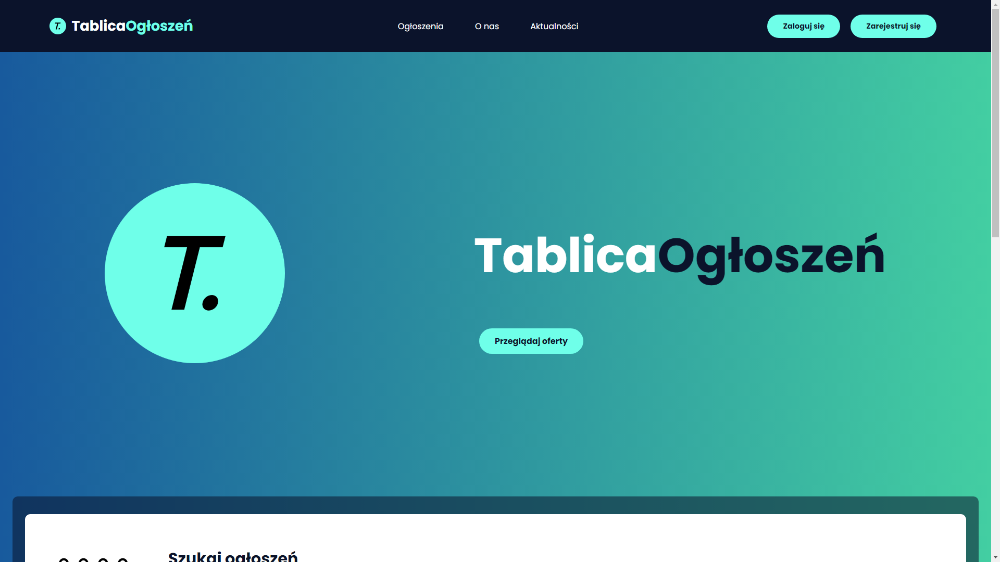
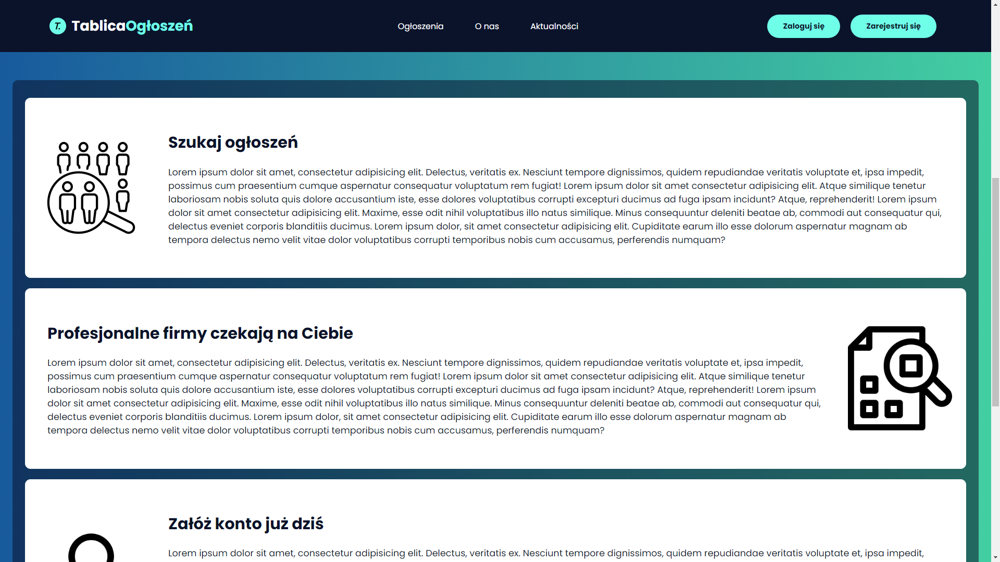
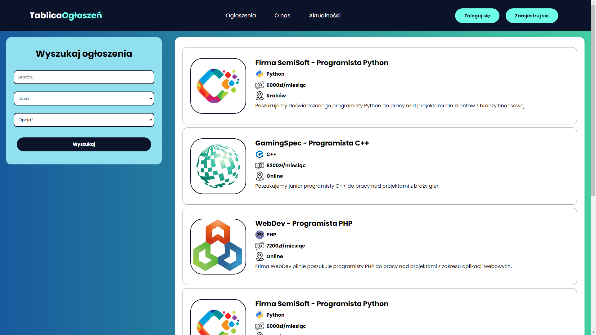
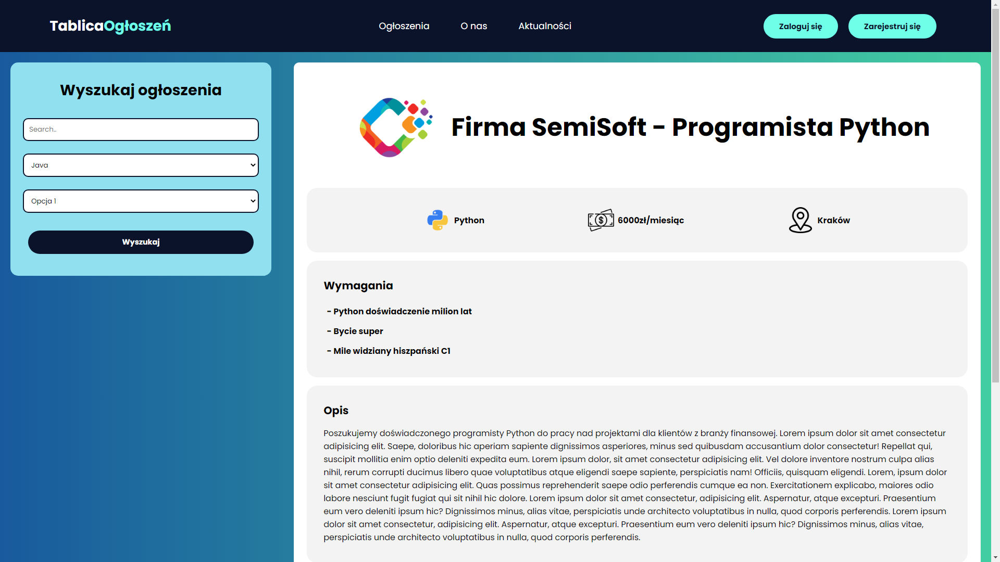
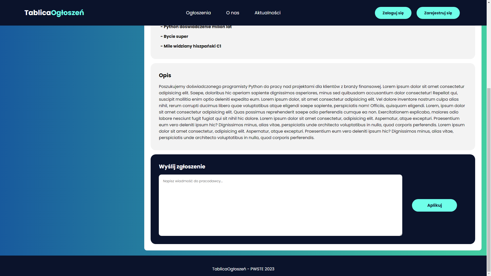
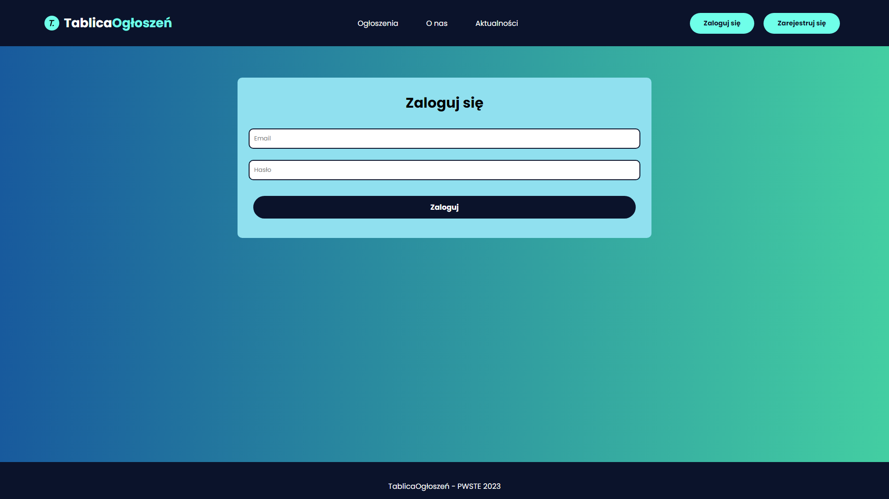
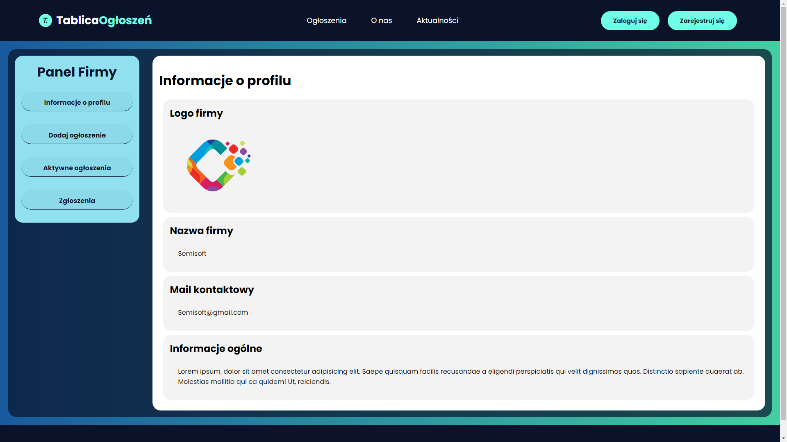
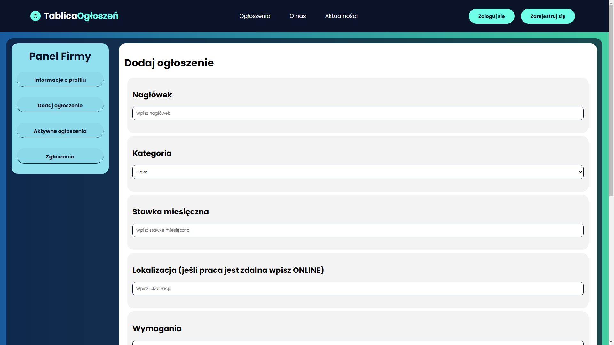
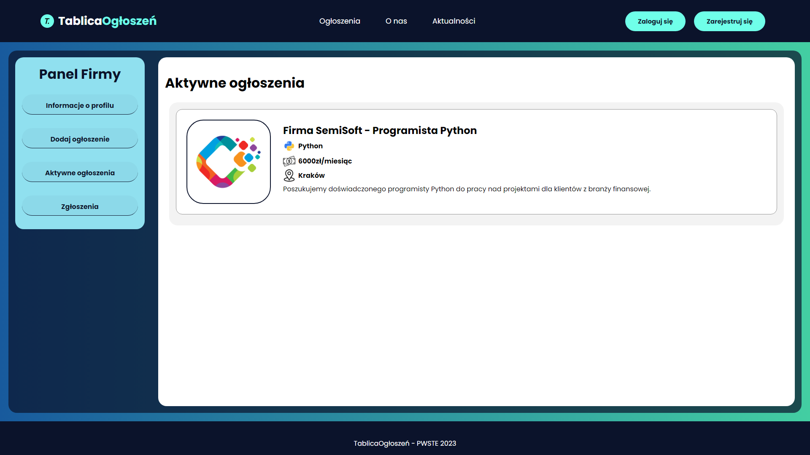
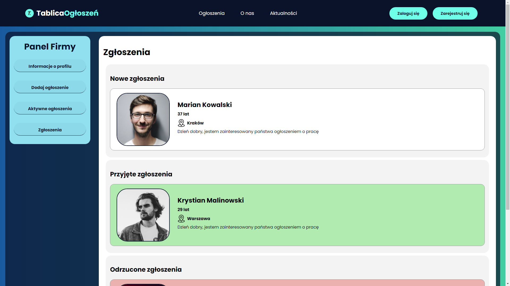

<h2 align="center">⚙️🔧 WORK IN PROGRESS 🔧⚙️</h2>

 

    
  <h3 align="center">Tablica Ogłoszeń Project</h3>
  
   

    

## O Projekcie
Tablica ogłoszeń jest to projekt powstały na potrzeby szkolne i portfolio. 
Prace nad tym projektem są **ciągle w toku więc nie posiada on jeszcze wszystkich wymienionych funkcjonalności.**

### Opis
Projekt tablica ogłoszeń jest niczym innym jak katalogiem ogłoszeń w którym mamy podział na dwa typy użytkowników  **pracowników poszukujących pracy** i **firmy** .
Firmy mogą dodawać ogłoszenia a pracownicy na nie aplikować.

### Funkcjonalności
* Pełna responsywność strony
* Rejestracja i logowanie 
* Autoryzacja (*Pracownik*, *Firma*, *Administrator*)
* Dodawanie, usuwanie, modyfikowanie ogłoszeń
* Obsługa formularzy zgłoszeń pracownika

### Stworzone za pomocą
* ![Laravel][Laravel.com]
* ![HTML][HTML5]
* ![CSS][CSS3]

## Screenshots

[Laravel.com]: https://img.shields.io/badge/Laravel-FF2D20?style=for-the-badge&logo=laravel&logoColor=white
[HTML5]: https://img.shields.io/badge/HTML5-E34F26?style=for-the-badge&logo=html5&logoColor=white
[CSS3]: https://img.shields.io/badge/CSS3-1572B6?style=for-the-badge&logo=css3&logoColor=white

